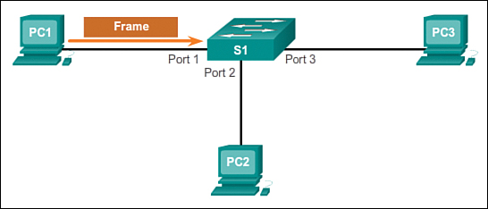
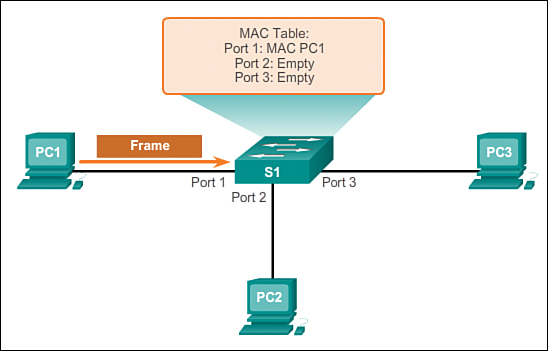
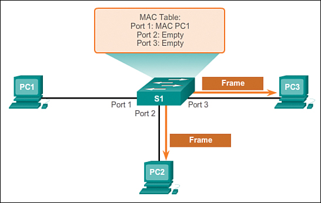
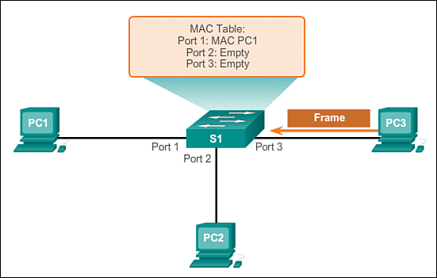
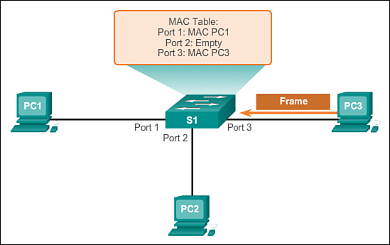
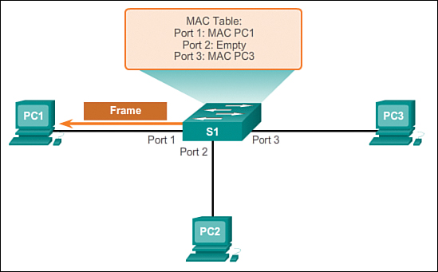
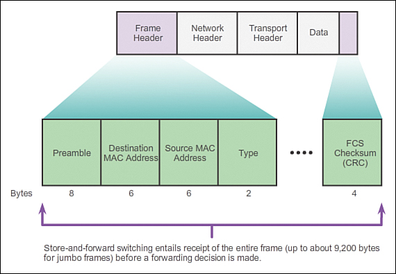
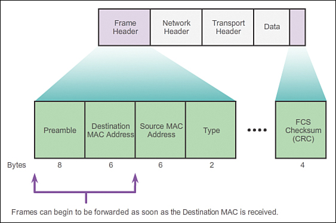
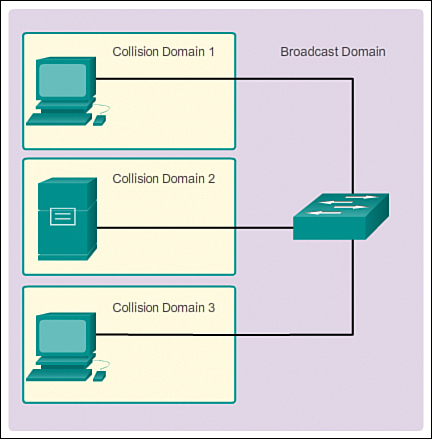

# 网络基本功(二)：细说交换机

# 介绍

本节介绍交换机的帧转发技术，MAC地址表的维护方式，三种帧转发模式，以及冲突域和广播域。

  

# 更多信息

**帧转发****:**

**网络及电信中的交换概念**

以太网上的帧包含源MAC地址与目的MAC地址。交换机从源设备接收到帧并快速发往目的地址。交换的基本概念指基于以下两条准则做出决策的设备：

· 进入（ingress）端口

· 目的地址

术语**ingress**用于描述帧通过特定端口进入设备，**egress**用于描述设备通过特定端口离开设备。交换机做出转发决定的时候，是基于进入端口以及消息的目的地址的。

LAN交换机维护一张表，通过这张表决定如何转发数据流。LAN交换机唯一智能部分是利用这张表基于消息的进入端口和目的地址来转发。一个LAN交换机中只有一张定义了地址和端口的主交换表；因此，**无论进入端口如何，同一目的地址的消息永远从同一出口离开。**

****MAC地址表的动态更新****

一个交换机要知道使用哪一个端口传送帧，首先必须学习各端口有哪些设备。随着交换机学习到端口与设备的关系，它建立起一张MAC地址表，或内容可寻址寄存表（CAM）。CAM是一种应用于高速查找应用的特定类型的memory。交换机将连接到它的端口的设备的MAC地址记录到MAC表中，然后利用表中信息将帧发送至输出端口设备，该端口已指定给该设备。

记住交换机操作模式的一句简单的话是：**交换机学习“源地址”，基于“目的地址”转发**。帧进入交换机时，交换机“学习”接收帧的源MAC地址，并将此地址添加到MAC地址表中，或刷新已存在的MAC地址表项的老化寄存器；后续报文如果**去往**该MAC地址，则可以根据此表项转发。帧转发时，交换机检查目的MAC地址并与MAC地址表中地址进行比较。如果地址在表中，则转发至表中与MAC地址相**对应的端口**。如果没有在表中找到目的MAC地址，交换机会转发到除了进入端口以外的所有端口泛洪（flooding）。有多个互连交换机的网络中，MAC地址表对于一个连接至其他交换机的端口记录多个MAC地址。

以下步骤描述了更新MAC地址表的方法：

1. 交换机在port 1接收到来自PC 1的帧。

2. 交换机检查源MAC地址并与MAC地址表相比较。

· 如果地址不在表中，则交换机在MAC地址表中将PC 1的源MAC地址关联到进入端口（port 1）。

· 如果已经存在该源地址的MAC地址表项，则交换机重置老化计时器。通常一个表项会保持5分钟。

3. 交换机记录源地址信息之后，检查目的地址

· 如果目的MAC地址不在表项中或如果它是一个广播MAC地址，则交换机把该帧泛洪（flood）至除了进入端口以外的所有端口。

4. 目标设备（PC 3）返回目的地址为PC 1的单播帧。

5. 交换机地址表中输入PC 3的源MAC地址以及进入端口的端口号。在表项中找到该帧的目的地址及关联的输出端口。

6. 交换机现在可以在源和目标设备之间传送帧而无需泛洪，因为地址表中已有指定关联端口的表项。

**交换机转发方式：**

**存储转发交换****(Store-and-Forward)**

运行在存储转发模式下的交换机在发送信息前要把整帧数据读入内存并检查其正确性。尽管采用这种方式比采用直通方式更花时间，但采用这种方式可以存储转发数据，从而保证其准确性。由于运行在存储转发模式下的交换机不传播错误数据，因而更适合大型局域网。存储转发模式有两大主要特征区别于直通转发模式：

差错控制：

使用存储转发技术的交换机对进入帧进行差错控制。在进入端口接收完整一帧之后，交换机将数据报最后一个字段的帧校验序列（frame check sequence, FCS）与自己的FCS进行比较。FCS校验过程用以帮助确保帧没有物理及数据链路错误，如果该帧校验正确，则交换机转发。否则，丢弃。

自动缓存：

存储转发交换机通过进入端口缓存，支持不同速率以太网的混合连接。例如，接收到一个以1Gb/s速率发出的帧，转发至百兆以太网端口，就需要使用存储转发方式。当进入与输出端口速率不匹配时，交换机将整帧内容放入缓存中，计算FCS校验，转发至输出缓存之后将帧发出。

Cisco的主要交换方式是存储转发交换。

**直通交换（****Cut-Through）**

直通交换的一个优势是比存储转发技术更为快速。采用直通模式的交换机会在接收完整个数据包之前就读取帧头，并决定把数据发往哪个端口。不用缓存数据也不用检查数据的完整性。这种交换方式有两大特点：快速帧转发以及无效帧处理。

快速帧转发：

如下图所示，一旦交换机在MAC地址表中查找到目的MAC地址，就立刻做出转发决定。而无需等待帧的剩余部分进入端口再做出转发决定。

使用直通方式的交换机能够快速决定是否有必要检查帧头的更多部分，以针对额外的过滤目的。例如，交换机可以检查前14个字节（源MAC地址，目的MAC，以太网类型字段），以及对之后的40字节进行检查，以实现IPv4三层和四层相关功能。

无效帧处理：

对于大多数无效帧，直通方式交换机并不将其丢弃。错误帧被转发至其他网段。如果网络中出现高差错率（无效帧），直通交换可能会对带宽造成不利影响，损坏以及无效帧会造成带宽拥塞。在拥塞情况下，这种交换机必须像存储转发交换机那样缓存。

**无碎片转发（****Fragment Free）**

无碎片转发是直通方式的一种改进模式。交换机转发之前检查帧是否大于64字节（小于则丢弃），以保证没有碎片帧。无碎片方式比直通方式拥有更好的差错检测，而实际上没有增加延时。它比较适合于高性能计算应用，即进程到进程延时小于10毫秒的应用场景。

**交换机域：**

交换机比较容易混淆的两个术语是冲突域和广播域。这一段讲述这两个影响LAN性能的重要概念。

**冲突域**

设备间共享同一网段称为冲突域。因为该网段内两个以上设备同时尝试通讯时，可能发生冲突。使用工作在数据链路层的交换机可将各个网段的冲突域隔离，并减少竞争带宽的设备数量。交换机的每一个端口就是一个新的网段，因为插入端口的设备之间无需竞争。结果是每一个端口都代表一个新的冲突域。网段上的设备可以使用更多带宽，冲突域内的冲突不会影响到其他网段，这也成为**微网段**。

如下图所示，每一个交换机端口连接到一台主机，每一个交换机端口代表一个隔离的冲突域。

**广播域**

尽管交换机按照MAC地址过滤大多数帧，它们并不能过滤广播帧。LAN上的交换机接收到广播包后，必须对所有端口泛洪。互连的交换机集合形成了一个广播域。网络层设备如路由器，可隔离二层广播域。路由器可同时隔离冲突和广播域。

当设备发出二层广播包，帧中的目的MAC地址被设置为全二进制数，广播域中的所有设备都会接收到该帧。二层广播域也称为MAC广播域。MAC广播域包含LAN上所有接收到广播帧的设备。广播通信比较多时，可能会带来广播风暴。特别是在包含不同速率的网段，高速网段产生的广播流量可能导致低速网段严重拥挤，乃至崩溃。